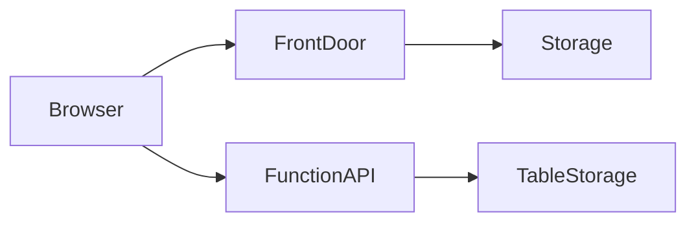

# CST8921 Lab 6: Code-First Static Web Delivery on Azure: SDK Provisioning, a Serverless API, and Edge Distribution

- Name: Bosi Chen
- Student ID: 041040774
- Course: CST8921 Cloud Industry Trends
- Lab: Lab 5 - Code-First Static Web Delivery on Azure: SDK Provisioning, a Serverless API, and Edge Distribution
- Submission Date: 

---

## Introduction

This lab explored a code-first approach for deploying and managing a static website on Azure. Instead of manually creating resources through the Azure Portal, Azure SDKs and automation scripts were used to provision infrastructure, configure static website hosting, deploy web content, integrate a serverless backend with Azure Functions, and clean up resources.

### Architecture Diagram

## Operations

### Part A: Authentication and the control-plane / data-plane split (concept)

The screenshot shows assigning the roles after provisioning all re resources in Part B. 

The resources owner doesn't have the authority to write data into a data resource, they only have the authority to create, edit or delete the resource itself. Any user who wanted to write data into it have to be granted a data-plane role.

### Part B

Create Azure resources using python script.

Creating a storage account may take few minutes to complete. Instead to let the user wait for minutes, it will be better toload the page for them at first and retrieve the information when it is ready.

Setting `allow_blob_public_access=False` will prevent external anonymous access to the blob data and reduce the risk to data exposure. Accessing the hosting via a `$web` endpoint can also prevent this.

### Part C

Enabling static website using python scripts.

The lab instructions highlighted a common SDK issue where error_document404_path must be specified exactly. Using the more intuitive error_document_404_path does not generate an error but silently fails. This introduced the importance of validating configuration changes by reading back service properties rather than assuming the API call succeeded.

### Part D

Building the sites by using HTML.

### Part E

Deploy the page using pythong script.

During deployment, content_settings was used to explicitly set the MIME type of uploaded files. Without the correct content type, browsers may treat HTML files as generic binary content and download them instead of rendering them.

The Cache-Control strategy uses no-cache for HTML files so browsers always revalidate the page and receive the latest version, while static assets can use a long-term immutable cache because they change less frequently and benefit from improved performance.

### Part F

Create the serverless api function, test it locally and deploy to Azure functions App. 

CORS (Cross-Origin Resource Sharing) is a browser security mechanism that restricts web pages from making requests to a different origin unless the target server explicitly allows it. 

The browser checks the `Access-Control-Allow-Origin` response header before exposing the response to JavaScript. Without this header, the browser will block the request even if the server successfully returns data. 

This is a browser-enforced policy designed to protect users from malicious websites attempting to access resources from other domains without permission.

### Part G

Unable to get access to Azure Front Door services due to student subscription limitation.

With Cache-Control: no-cache, browsers and edge services are instructed to revalidate the HTML content with the origin before using a cached copy. 

In many situations this reduces the need for manual cache purging since the updated content can be detected automatically. However, cached copies may still exist at edge locations for a period of time, so cache purging can still be useful when immediate propagation of updates is required.

### Part H

When running twice, it will only make updates if necessary and not duplicating the practices. IaC tools are build on this concept by continuously comparing the required state with the actual state and automatically applying updates whe necessary.

## Analysis questions (answer all in the report)

1. The original lab used the portal and a deploy extension. Identify **three** specific failure modes of that manual approach that the code-first approach eliminates or makes detectable.
   
  1. Human error of creating resources with wrong settings.
  2. Missing or inconsistent deployment steps between environments.
  3. Lack of repeatability and documentation for future deployments.

2. Static website hosting is a *data-plane* operation but storage account creation is *control-plane*. Explain the security and operational reasons Azure separates these permission systems.

  Control-plane permissions manage Azure resources themselves, while data-plane permissions manage access to the data stored inside those resources. 
  
  Separating these permissions improves security by preventing resource administrators from automatically gaining access to sensitive data. It also allows organizations to enforce least-privilege access controls.

3. You uploaded HTML with `Cache-Control: no-cache` but assets with a one-year `immutable` cache. Describe a deployment in which this strategy causes a user to see a broken page, and how you would prevent it (hint: asset fingerprinting / content hashing).

  A new HTML file may reference updated JavaScript assets while users still have older cached assets stored locally. This can cause missing functionality or runtime errors. 
  
  Asset fingerprinting or content hashing can solve this problem by generating unique filenames whenever assets change.

4. The visit counter moved dynamic logic out of the static site and into a serverless function. What did you gain, and what new failure modes and costs did you introduce by adding the API?

  Benefits:

  - Dynamic functionality.
  - Separation of frontend and backend logic.
  - Better scalability.

  Drawbacks:

  - Additional latency.
  - Additional operational complexity.
  - Potential Function execution costs.
  - New failure points such as API outages or storage connectivity issues.

5. Front Door caches at the edge. Give one scenario where edge caching *hurts* correctness and explain how you would mitigate it without disabling caching entirely.

  Caching dynamic content such as inventory counts, stock levels, or user-specific information can present outdated data to users. 
  
  This can be mitigated by using shorter cache durations, cache revalidation, cache purging, or excluding dynamic endpoints from caching.